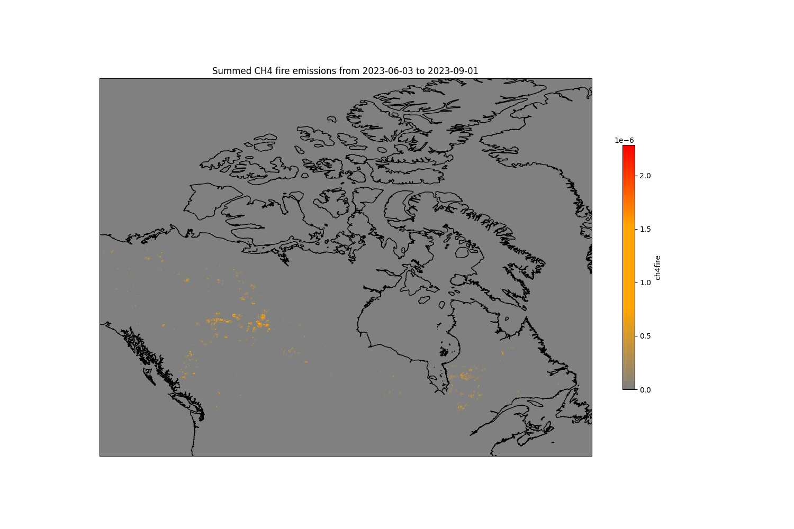

# Fire emissions in Canada in 2023 (CAMS) 

Notebook for visualizing and analyzing various gas emissions from forest fires in Canada with Copernicus CAMS data
The file 'requirements.txt' contains all the required packages to run the notebook.

The notebook is divided in 2 parts:

### Extracting data from .grib file
An example on how to load a grib file downloaded from the Copernicus CAMS database.
The data is accessible here: https://ads.atmosphere.copernicus.eu/cdsapp#!/dataset/cams-global-fire-emissions-gfas?tab=overview

The example notebook shows how to load the file and use the data to compute the approximate total emissions due to forest fires (in Kg).
The .grib file used for this notebook contained data for CO2, CH4, CO and NOx for the period of 2023-06-03 to 2023-09-01.
In the first few cells we filter the dataset to only keep the region of Canada.

The [pyproj](https://pypi.org/project/pyproj/) library is used to get the affected areas for the total emissions computation in Kg.

### Visualizing the data
The second part of the notebook shows how to create images of the cumulative emissions of the concerned period of time and gifs of the evolution of emissions over time.
Examples:

Cumulative emissions of CH4                          | Evolution of emissions of CH4
:-------------------------:|:-------------------------:
 | 
